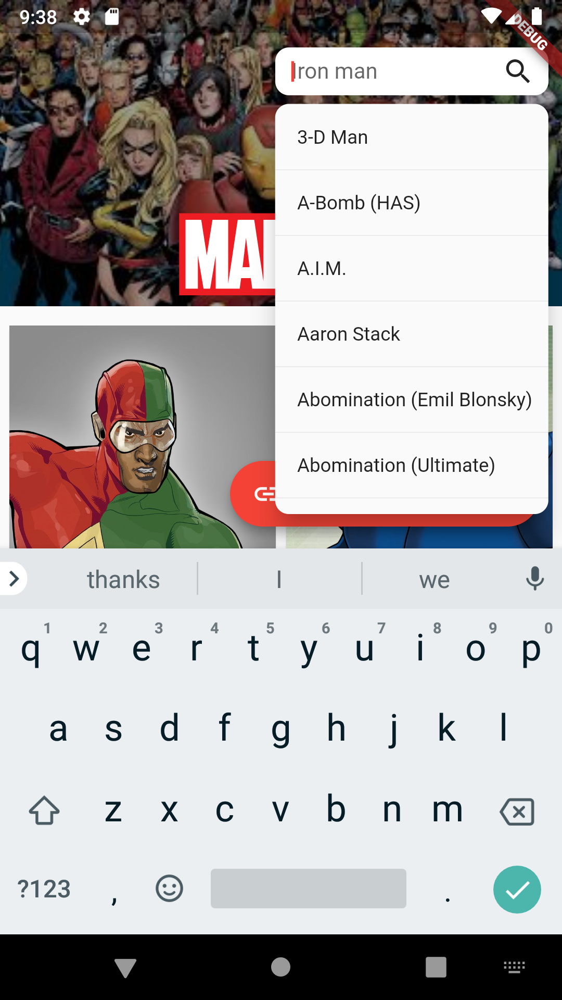

# riverpod_marvel

A Flutter app which uses Marvel API to show Marvel characters using riverpod library.

Original source code at
https://github.com/rrousselGit/river_pod/tree/master/examples/marvel

<table>
<tbody align="center">

<tr>
<td><b>Characters</b></td>
<td><b>Character Detail</b></td>
<td><b>Search</b></td>
</tr>

<tr>
<td></td>
<td></td>
<td></td>
</tr>

</tbody>
</table>