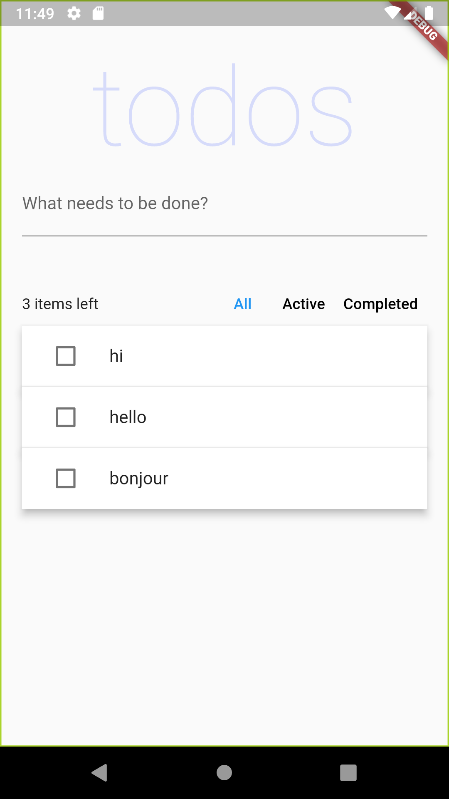
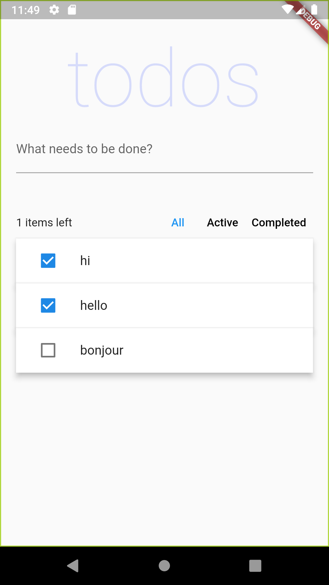
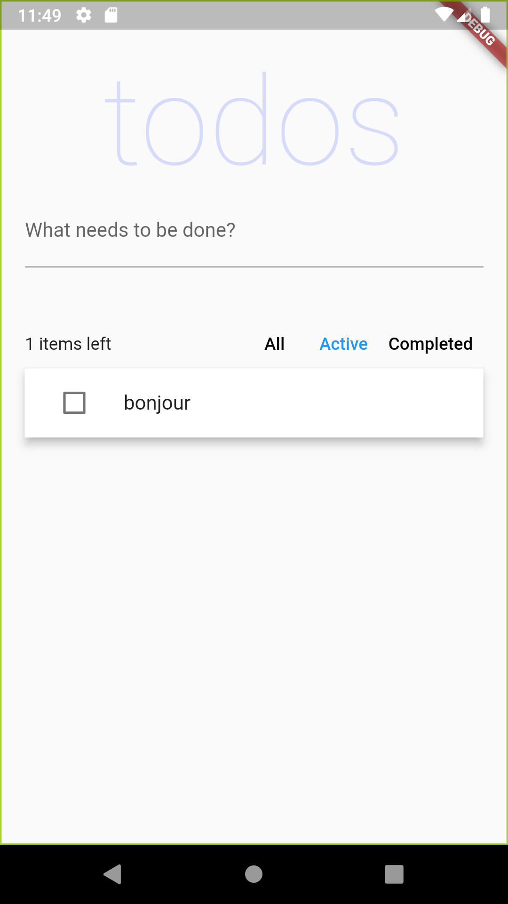
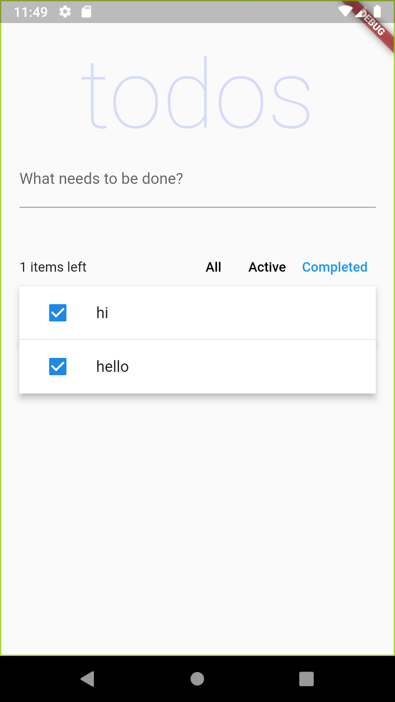
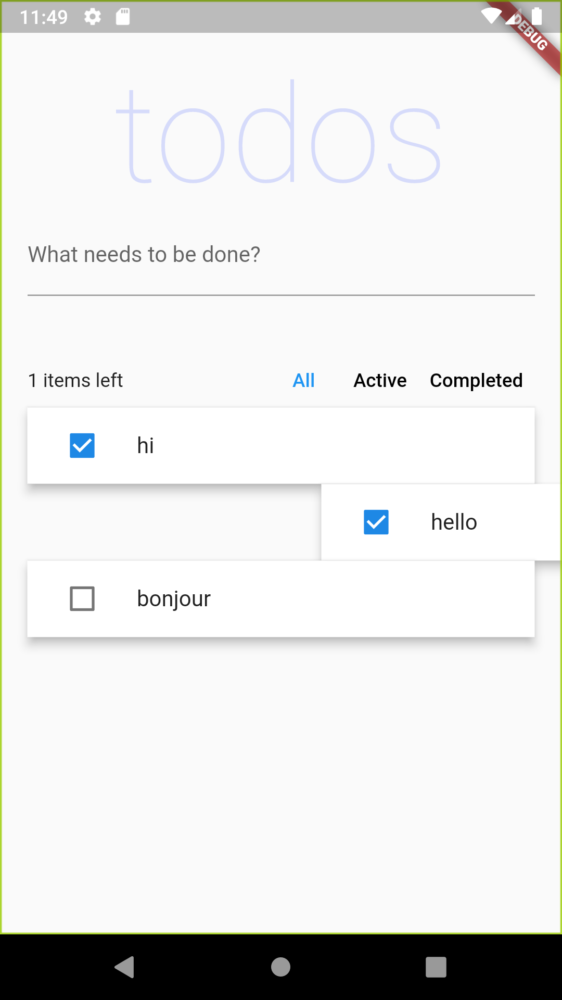
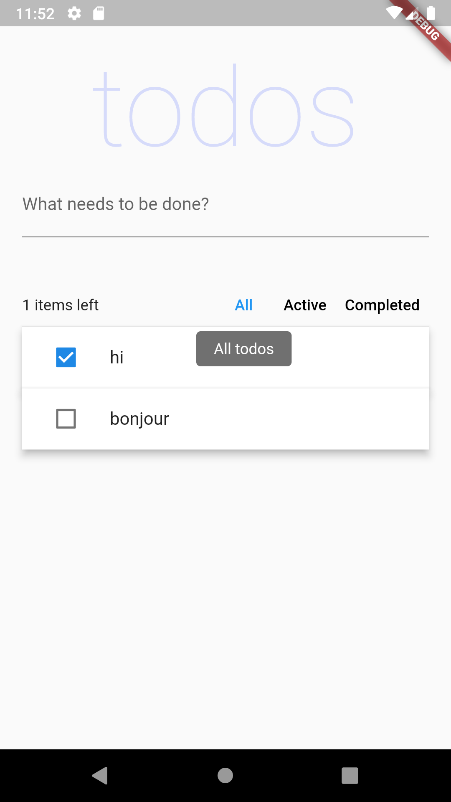

Todos app in Flutter using riverpod

Original source code at
https://github.com/rrousselGit/river_pod/tree/master/examples/todos

|         |             |                |
|:-------:|:-----------:|:--------------:|
|__Todos__|__All Todos__|__Active Todos__|
||||
|__Completed Todos__|__Dismissing a Todo__|__Showing the Message__|
||||
